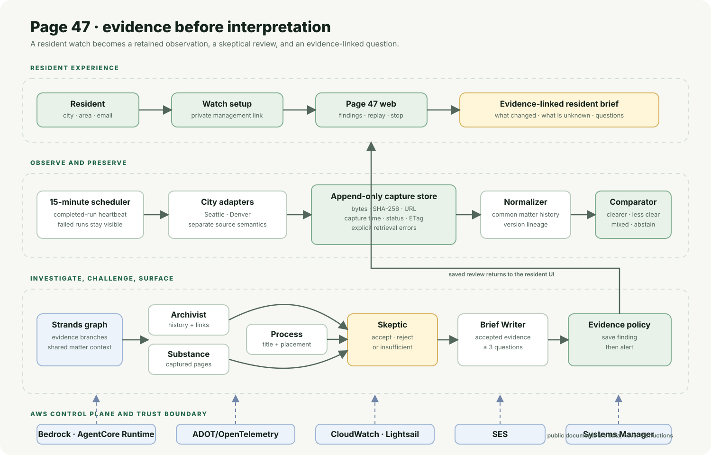
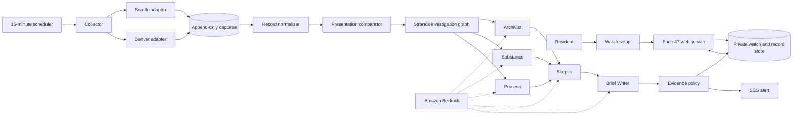

# Page 47

## When the packet changes, residents should know.

Page 47 is an evidence-first civic record watcher. A resident chooses a city
and area once; Page 47 keeps checking public meeting records, compares how a
matter appeared across meetings, investigates the change, and sends an
evidence-linked review only when the record supports one.

**Tell Page 47 what you care about. It watches the public record while you are away.**

[Create a watch](https://page47.xcover.online/) · [Open a captured review](https://page47.xcover.online/explore) · [Read the submission kit](docs/submission.md) · [View the architecture](docs/architecture.md) · [Browse the code](https://github.com/Jennycruzy/Page47)

> Page 47 does not guess intent, assign a political position, or turn an
> uncertain record into a confident story. It shows what changed, what supports
> the observation, and what remains unknown.

## The problem

Public decisions are often spread across meeting agendas, consent calendars,
attachments, and revised packets. A resident may care deeply about one area
without having the time to check every meeting or notice when the same matter
is presented differently later.

Page 47 watches the public record between visits. Its core question is not only
“What does the latest document say?” but also “How did this matter appear the
last time, and what evidence supports the difference?”

## Who it is for

Page 47 is for residents, neighbourhood groups, local journalists, and civic
organisations that need a practical way to follow public matters without
turning civic participation into a full-time monitoring job.

Seattle is the flagship deployment. Denver is the portability proof: it uses
the same product flow with a separate city adapter and separately calibrated
agenda semantics.

## The resident experience

1. **Watch an area.** Choose a city, neighbourhood or address, and email.
2. **Walk away.** The watch is stored server-side; the browser does not need to
   remain open.
3. **Page 47 observes.** A scheduled collector preserves public responses,
   document bytes, hashes, URLs, capture times, and errors.
4. **Page 47 compares.** Titles, agenda placement, and supported document
   substance are evaluated as separate dimensions.
5. **Page 47 investigates.** Archivist, Substance, and Process readers gather
   evidence; the Skeptic can reject an attractive but unsupported interpretation.
6. **The resident decides.** A surfaced finding links to the exact public
   record and ends with no more than three questions worth asking. The resident
   can stop the watch at any time.

The live site also exposes stored reviews, a captured-case replay path, matter
history, evidence links, and the private watch management path used by the
application. Replay is explicitly labeled as stored public records, not a live
event.

## What a finding means

Page 47 never compresses the evidence into an unexplained risk score. The
result is a directional description of the presentation, with the dimensions
shown separately:

| Result | Meaning |
| --- | --- |
| `clearer` | At least one supported dimension became clearer and none became less clear. |
| `less_clear` | At least one supported dimension became less clear and none became clearer. |
| `mixed` | Comparable dimensions moved in opposite directions. |
| `unchanged` | At least two comparable dimensions were neutral. |
| `cannot_determine` | The available evidence cannot establish a direction. |

For example, a title becoming less specific while agenda placement becomes
more visible is `mixed`, not `unchanged`. A single neutral observation is not
treated as proof that nothing changed. Unreliable city attachment timestamps
are not used as publication-timing evidence.

## Evidence before interpretation

Each consequential observation carries the primary URL, capture time, and page
reference when applicable. Page 47 keeps the boundary between:

| Evidence position | What it means |
| --- | --- |
| **Observed by Page 47** | Page 47 captured the earlier and later public versions itself. |
| **Reconstructed from public record** | Earlier and later records are available now, but Page 47 did not witness the transition. |
| **Current public record** | The claim describes the record that is available now, without asserting a historical transition. |
| **Cannot determine** | The record does not support a directional or causal conclusion. |

The product can establish that a title, placement, or attachment changed. It
cannot establish why a public body changed it, whether anyone intended to
reduce visibility, or what an unpublished intermediate version contained.

The `Observed by Page 47` label is intentionally strict: both sides of the
transition must carry different Page 47 capture keys, ordered capture times,
and qualifying collector-run provenance after the configured production
baseline. A single captured document, reverse capture chronology, or two
historical records that are available today is not enough to claim that Page 47
observed a transition.
Area matching follows the same discipline. A direct street or neighbourhood
mention is reported separately from a weaker public-body or jurisdiction
inference, and the matched record fields are retained with the watch result.

## Why an agent is useful here

This is a background evidence task, not a chat prompt waiting for a resident to
ask the right question. The graph gives distinct evidence responsibilities to
five roles:

| Role | Responsibility |
| --- | --- |
| **Archivist** | Reads the stored matter history and anchors observations to captured records. |
| **Substance** | Reads only captured document pages and reports concrete provision changes. |
| **Process** | Examines titles, bodies, agenda placement, order, and supported process facts. |
| **Skeptic** | Reviews the branches, rejects unsupported observations, and does not add facts. |
| **Brief Writer** | Turns accepted observations into a short, plain-language resident brief. |

The deterministic comparator handles directional semantics. The graph is used
where evidence roles need different views of the record and where a separate
reviewer must be able to veto a weak interpretation.

## Architecture

The full judge-facing diagram and system boundaries are in
[docs/architecture.md](docs/architecture.md).





## AWS implementation

| AWS component | Page 47 use |
| --- | --- |
| **Amazon Lightsail** | Public web service, scheduled collection, SQLite record store, and captured evidence on the deployment host. |
| **Amazon S3** | Private, versioned off-host copy of captured bytes and operational evidence files, verified by the scheduled backup path. |
| **Amazon Bedrock** | Document and evidence reading models used by the investigation roles. |
| **Amazon Bedrock AgentCore Runtime** | Managed execution for the Strands investigation graph. |
| **AWS Distro for OpenTelemetry** | Runtime instrumentation for searchable investigation traces. |
| **Amazon CloudWatch** | Service logs, collector completion metric, and missed-run alarm. |
| **Amazon SES** | Evidence-linked transactional review alerts. |
| **AWS Systems Manager** | Deployment parameters and secret-free host configuration. |

The collector preserves bytes, SHA-256 hashes, source URLs, capture times,
HTTP status, ETags when available, and explicit failures. A changed document at
the same URL is therefore visible as a new captured version rather than silently
replacing the previous observation. Each capture manifest also has a local
chained integrity record. The `scripts/backup_evidence.py` command verifies
that chain before incrementally copying captured bytes, manifests, runs, and
changes to S3. The scheduled collector invokes it automatically with the
private, versioned bucket `page47-evidence-591697681173-eu-west-2-an`. The
first verified backup copied 2,047 Seattle objects and 1,313 Denver objects;
a repeat backup uploaded zero objects and skipped all unchanged objects.

## Evaluation without overclaiming

Page 47 has three separate proof layers:

1. **Real Seattle export:** 100 matters were evaluated across four arms. All
   four arms surfaced zero cases, and Page 47 returned `cannot_determine` for
   all 100. The completed 30-case human audit is preserved; all 30 historical
   gold labels are `cannot_determine`. This shows abstention when the
   available history is insufficient. It is not a directional accuracy claim.
2. **Controlled directional fixture:** 28 frozen transformations produced
   28/28 expected comparator states, including mixed directions, abstentions,
   replacement hashes, duplicate copies, unsupported-motive cases, and
   instruction-like document text. Two reversal pairs were correct in both
   directions. The deterministic fixture is not a real-world accuracy claim.
3. **Independently reviewed historical challenge cohort:** the repository
   includes 37 real Seattle matters selected without using Page 47's result: 5
   mechanically selected candidates and 32 controls. Three recurring agenda or
   minutes container records were excluded before the completed reviews were
   imported. Reviewer A and Reviewer B labels, reasons, primary evidence, and
   matching adjudicated labels are retained in the [complete review
   packet](docs/historical-challenge-cohort.json). The [browser-friendly case
   index](docs/historical-challenge/index.json) links to each case, and the
   [public answer key](docs/historical-challenge-answer-key.json) exposes the
   selection roles now that review is complete. This is a challenge cohort, not
   a prevalence sample or a representative accuracy estimate. The current
   comparator score is in the [challenge results](docs/historical-challenge-results.json):
   2 of 37 cases were surfaced, both candidate cases, with no surfaced control;
   all 89 adjudicated evidence records passed provenance checks.
4. **Managed runtime proof:** a real stored Seattle matter completed through the
   deployed AgentCore runtime, retained its investigation, and produced a
   searchable trace. See the [observability audit](docs/audits/observability.md)
   and [managed runtime review](docs/audits/managed-runtime.md).

The repository also retains the [independent comparison review](docs/audits/evaluation-independent-review.md),
[four-arm results](docs/comparison-results.json), and controlled results so a
judge can inspect the evidence rather than rely on a marketing percentage.

The forward-observation verifier makes the remaining time-dependent claim
explicit. It reports a positive case only when two distinct captured versions
support a directional comparison; until then it reports
`awaiting_real_transition`. Page 47 does not turn a fixture or historical
reconstruction into a forward-observation claim. Run it with:

```bash
PYTHONPATH=src python scripts/check_forward_observations.py \
  --city "Seattle, Washington" \
  --database runtime/records/seattle.sqlite3 \
  --evidence-root runtime/evidence/seattle \
  --presentation config/presentation.yaml \
  --output /tmp/page47-forward-observation.json
```

To run the evidence backup manually against a configured bucket:

```bash
PYTHONPATH=src python scripts/backup_evidence.py \
  --evidence-root runtime/evidence/seattle \
  --bucket YOUR_BUCKET \
  --prefix page47-evidence/seattle \
  --region eu-west-2
```

## Run locally

Requires Python 3.12 or newer.

```bash
git clone https://github.com/Jennycruzy/Page47.git
cd Page47
python3.12 -m venv .venv
. .venv/bin/activate
python -m pip install -e '.[dev]'
PYTHONPATH=src pytest
ruff check src/page47 scripts tests
MYPYPATH=src mypy --strict --explicit-package-bases src/page47
```

To run the controlled comparator evaluation:

```bash
PYTHONPATH=src python scripts/run_controlled_evaluation.py \
  --fixture config/evaluation-controlled.json \
  --presentation config/presentation.yaml \
  --output /tmp/page47-controlled-results.json
```

To run the web service against local configuration:

```bash
PYTHONPATH=src uvicorn page47.web.app:app --host 127.0.0.1 --port 8090
```

Live collection and managed AgentCore execution require AWS access configured
outside the repository. Never commit credentials, tokens, private keys, or
runtime secrets.

## Repository map

| Path | Purpose |
| --- | --- |
| `src/page47/` | Application, adapters, comparison, evidence, investigation, notifications, and web service. |
| `config/` | City mappings, presentation rules, agent roles, policy, and deployment configuration. |
| `scripts/` | Source discovery, capture, backfill, evaluation, validation, deployment, and operational checks. |
| `tests/` | Offline application, evidence, evaluation, delivery, and deployment tests. |
| `docs/audits/` | Dated operational, evaluation, delivery, and observability records. |
| `docs/architecture.md` | Detailed judge-facing architecture and trust boundaries. |
| `docs/submission.md` | Copy-ready submission description, required links, and rubric crosswalk. |

## Current limitations

The public city APIs expose only records that are currently available. A city
may replace a PDF at the same URL, overwrite a last-modified value, or remove
an intermediate version; Page 47 cannot reconstruct what it never captured.
Seattle placement is read from captured agenda PDFs because its API placement
integer is not reliable. Denver uses its own calibrated mapping.

SES production access was requested for `eu-west-2` on 11 September 2026 and is
currently under review. The sender identity and `page47.xcover.online` sending
domain are verified. Until production access is approved, SES sandbox rules
require the recipient of a live test alert to be verified; the web finding and
its evidence remain independently usable.

## License

Released under the [MIT License](LICENSE).
