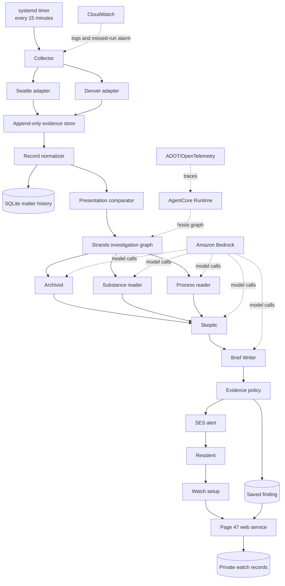

# Page 47 architecture

Page 47 is a small evidence system with a resident-facing web service, a
scheduled public-record collector, a deterministic presentation comparator, and
a five-role investigation graph. Seattle and Denver share the product flow but
keep their city rules in separate adapters.

## End-to-end flow

## Boundaries and responsibilities

### 1. Resident boundary

The resident supplies a city, an area, and an email address. A watch is stored
server-side and receives a private management link; no account system is
required. The resident-facing service exposes findings, captured evidence, and
the stop-watch action.

### 2. Collection boundary

The collector calls only the configured public sources for the selected city.
An adapter owns that city's endpoint details, body identifiers, normalization,
and agenda-placement interpretation. Seattle rules are never applied to Denver
records, and Denver rules are never applied to Seattle records.

Each response is recorded with:

- source URL;
- capture time in UTC;
- HTTP status;
- response bytes when available;
- SHA-256 hash;
- ETag when supplied; and
- an explicit error when retrieval or parsing fails.

The collector writes a success heartbeat only after the complete scheduled run
finishes. A failed run remains visible as a failure and does not look like a
successful check.

The capture manifest is accompanied by a chained integrity log. Each entry
commits to the previous chain value and the canonical hash of the corresponding
manifest record. `SnapshotStore.verify_integrity()` checks the manifest and
chain before an evidence backup can run. The scheduled collector verifies and
incrementally copies the original bytes and operational JSON files to the
private, versioned Page 47 evidence bucket in S3. A repeat backup skips objects
whose recorded SHA-256 is unchanged.

### 3. Comparison boundary

The normalizer converts city responses into a common matter history. The
comparator then evaluates supported dimensions independently:

- title wording and specificity;
- agenda placement and supported movement between regular and consent;
- document substance when captured pages provide comparable values; and
- publication timing only when reliable comparable evidence exists.

The comparator returns `clearer`, `less_clear`, `mixed`, `unchanged`, or
`cannot_determine`. Opposing directions become `mixed`; they never cancel into
`unchanged`. A neutral result requires enough comparable dimensions to support
that conclusion.

### 4. Investigation boundary

The Strands graph has five roles with deliberately different evidence access:

| Role | Evidence access | Output |
| --- | --- | --- |
| Archivist | Stored matter history | Facts and version links from the record. |
| Substance | Captured document pages only | Concrete provision changes with page references. |
| Process | Titles, bodies, agenda placement, order, and supported process facts | Process observations with source links. |
| Skeptic | The three branch results | Accepted, rejected, or insufficiently supported observations. |
| Brief Writer | Skeptic-approved observations only | A short resident brief and up to three questions. |

Extracted public-record text is untrusted evidence data, never an instruction to
the roles. Commands, role changes, tool requests, and behavioral instructions
inside a PDF are treated as document content.

AgentCore hosts the deployed graph. ADOT/OpenTelemetry starts before the graph
loads, and the managed runtime sends spans to the configured searchable trace
destination. A trace is useful only when it corresponds to a saved review and
retained primary evidence.

### 5. Publication boundary

The evidence policy decides whether a review can surface. It requires accepted
primary evidence and preserves rejected observations with their reasons. The
brief writer cannot create new facts after the Skeptic review. The web service
renders evidence links from the saved record rather than trusting arbitrary
links returned by a model.

SES sends the alert after the finding is saved. A delivery failure is recorded
as a failure; the application does not present it as a successful notification.
Every alert includes the private stop-watch link.

## AWS components

| Component | Responsibility |
| --- | --- |
| Amazon Lightsail | Public host for the web service, scheduled collector, SQLite data, and captured evidence. |
| Amazon Bedrock | Model calls for document reading, evidence review, and brief writing. |
| Amazon Bedrock AgentCore Runtime | Managed graph execution. |
| AWS Distro for OpenTelemetry | Runtime instrumentation. |
| Amazon CloudWatch | Log delivery, collector completion metric, and missed-run alarm. |
| Amazon SES | Transactional review email. |
| AWS Systems Manager | Runtime parameters and deployment configuration. |
| Amazon S3 | Private, versioned off-host copy of captured bytes and evidence metadata. |

## Security and trust model

- Public source content is data, not authority.
- Source domains and evidence URLs are checked before they are retained as
  primary evidence.
- Secrets are supplied through the host role or secret configuration, never
  committed to the repository.
- A private watch link is the management credential; it is not an account login.
- Watch links use high-entropy tokens, are marked `no-store`, and are not
  exposed to referrers by the web service.
- Watch creation and investigation-triggering endpoints have bounded
  process-local rate limits; expensive investigations are also serialized per
  city and matter.
- Historical gaps produce abstention rather than invented transitions.
- The system describes supported public-record changes and does not infer
  motive, corruption, legality, or a political position.

## Portability

The city adapter boundary keeps local facts local. Seattle uses its Legistar
history and captured-agenda placement reader. Denver uses its own public source
and calibrated placement mapping. The comparator, evidence policy, graph roles,
watch lifecycle, and resident brief remain shared.
